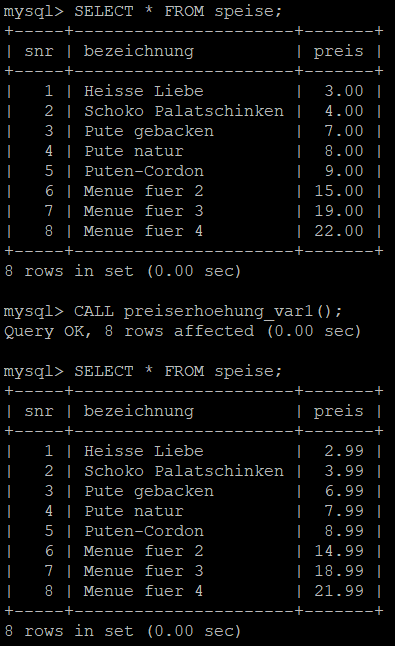
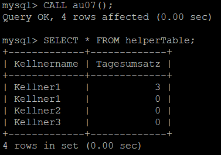

# PostgreSQL zu MySQL umwandeln

Dokument zur Umwandlung von PostgreSQL zu MySQL

Die Syntax der beiden Sprachen unterscheidet sich in einigen Punkten. Stored Procedures können in MySQL keine Werte zurückliefern. Somit fällt ```RETURNS \<TYP> AS $$ ... $$``` weg. **Parameter** von solchen Procedures werden mit einem Parameternamen deklariert. Die Verwendung von $1, $2, ... ist in MySQL nicht mehr möglich. Statt ```AS $$ ... $$``` wird hier ```BEGIN ... END;``` verwendet. 
Weiters kann man den __Delimiter__ vom Semikolon auf etwas anderes (bsp. //) ändern, da es sonst zu Syntax Fehlern kommen kann beim Aufbau von Stored Procedures. 

# Übungen:

## AU01 (Drei Varianten)

### __Variante 1:__
---
```sql
DELIMITER //
DROP PROCEDURE IF EXISTS preiserhoehung_var1 //
CREATE PROCEDURE preiserhoehung_var1() 
    BEGIN
    UPDATE speise SET preis = ceil(preis) - 0.01;
    END;// 
DELIMITER ;

SELECT * FROM speise;
CALL preiserhoehung_var1();
SELECT * FROM speise;
```
<center>
<kbd>



</kbd>
</center>

### __Variante 2:__
---
```sql
DELIMITER //
DROP PROCEDURE IF EXISTS preiserhoehung_var2 //
CREATE PROCEDURE preiserhoehung_var2() 
    BEGIN
    UPDATE speise SET preis = floor(preis) + 0.99;
    END;//
DELIMITER ;

SELECT * FROM speise;
CALL preiserhoehung_var2();
SELECT * FROM speise;
```
<center>
<kbd>


</kbd>
</center>

### __Variante 3__
---
```sql
DELIMITER // 
DROP PROCEDURE IF EXISTS preiserhoehung_var3 //
CREATE PROCEDURE preiserhoehung_var3() 
    BEGIN
    UPDATE speise SET preis = TRUNCATE(preis,0) + 0.99;
    END;//
DELIMITER ;

SELECT * FROM speise;
CALL preiserhoehung_var3();
SELECT * FROM speise;
```
<center>
<kbd>


</kbd>
</center>

## __AU02__

Es werden Procedures, welche Paramter enthalten benötigt. Hier muss allerdings alles in einer Methode gemacht werden.

__Parameter__ von Procedures werden in einer Klammer angegeben. Dort gibt man auch den Datentyp mit an. In der Procedure kann man sie dann ganz normal über den Parameternamen ansprechen.  
```SQL
DELIMITER //
DROP PROCEDURE IF EXISTS preisErhoehung //
CREATE PROCEDURE preisErhoehung (fixedValue DECIMAL(4,2), percent DECIMAL(4,2))
BEGIN
    DECLARE avgPrice DECIMAL(20,10);
    SELECT avg(preis) INTO avgPrice FROM speise;
    UPDATE speise SET preis = preis + fixedValue 
    WHERE preis <= avgPrice;
    UPDATE speise SET preis = preis + preis * percent / 100 
    WHERE preis > avgPrice;
END;//
DELIMITER ;
```

In diesem Fall werden die Preise, die __kleiner__ als der Durchschnittspreis sind um 1 erhöht, alle anderen werden um 5% erhöht.  
```SQL
SELECT * FROM speise;
CALL preisErhoehung (1,5);
SELECT * FROM speise;
```

<center>
<kbd>


</kbd>
</center>

## __AU03__

```sql
INSERT INTO rechnung VALUES (7, CURRENT_DATE, 1, 'bezahlt', 1);
```
```sql
DELIMITER //
DROP PROCEDURE IF EXISTS umsatz_au03 //
CREATE PROCEDURE umsatz_au03(kellnerNr INTEGER(255))
    BEGIN
        SELECT SUM(speise.preis)
        FROM speise,rechnung,bestellung
        WHERE speise.snr = bestellung.snr
        AND rechnung.rnr = bestellung.rnr
        AND rechnung.status = 'bezahlt'
        AND rechnung.knr = kellnerNr
        AND rechnung.datum = CURRENT_DATE;
    END;//
DELIMITER ;

CALL umsatz_au03(1);
```
<center>
<kbd>


</kbd>
</center>

## __AU04__

### __a)__
---
Hier wird der Preis aus der Tabelle Speise ausgelesen und so bearbeitet, dass die Spalten Brutto und Mehrwertsteuer enstehen und ausgegeben werden.  
```sql
DELIMITER //
DROP PROCEDURE IF EXISTS au04a //
CREATE PROCEDURE au04a()
    BEGIN
        SELECT bezeichnung,
        preis AS "Netto",
        preis * 1.2 AS "Brutto",
        preis * 0.2 AS "Mehrwertsteuer" 
        FROM speise;
    END;//

DELIMITER ;
CALL au04a();
```
<center>
<kbd>


</kbd>
</center>

### __b)__
---
Man benutzt die ```CAST``` Funktion, um auf Nachkommastellen beschränken zu können.
```sql
DELIMITER //
DROP PROCEDURE IF EXISTS au04b //
CREATE PROCEDURE au04b()
    BEGIN
        SELECT bezeichnung,
        preis AS "Netto",
        CAST(preis * 1.2 AS DECIMAL (6,2)) AS "Brutto",
        CAST(preis * 0.2 AS DECIMAL (6,2)) AS "Mehrwertsteuer" 
        FROM speise;
    END;//

DELIMITER ;
CALL au04b();
```
<center>
<kbd>


</kbd>
</center>

## __AU05__

### __a)__
---
```sql
DELIMITER //
DROP PROCEDURE IF EXISTS au05//
CREATE PROCEDURE au05()
BEGIN
    SELECT speise.bezeichnung AS "Bezeichnung" FROM speise
    WHERE speise.snr NOT IN (SELECT snr FROM bestellung);
END;//
DELIMITER ;
CALL au05();
```
<center>
<kbd>


</kbd>
</center>

### __b)__
---
Man macht ```SELECT aaa AS "<Spaltenname>"``` schreibt.
```sql
DELIMITER //
DROP PROCEDURE IF EXISTS au05b//
CREATE PROCEDURE au05b()
BEGIN
    SELECT speise.bezeichnung AS "Bezeichnung",
    speise.preis AS "Nettopreis" FROM speise
    WHERE speise.snr NOT IN (SELECT snr FROM bestellung);
END;//
DELIMITER ;
CALL au05b();
```
<center>
<kbd>


</kbd>
</center>

## __AU06__

Diese Aufgabenstellung ist in MySQL nicht lösbar, da man sich die Werte anzahlRechnung und statusRechnung nicht zwischenspeichern kann. Könnte man Dinge, die mehr als eine Row als Result haben in Variablen speichern, würde es funktionieren. Außerdem kann man keine Procedures in einer weiteren Procedure aufrufen.

## __AU07__

Hierbei benötigt man eine "helperTabel". Dies ist eine temporäre Tabelle.

Um die Daten der Abfrage dort hinein zu bekommen muss in der Stored Procedure ```INSERT INTO <tabellenname>``` ausgeführt werden.
```sql

DROP TABLE IF EXISTS helperTable;
CREATE TABLE helperTable(
    Kellnername VARCHAR(255),
    Tagesumsatz NUMERIC
);

DELIMITER //
DROP PROCEDURE IF EXISTS au07 //
CREATE PROCEDURE au07()
BEGIN
    INSERT INTO helperTable
    SELECT kellner.name AS "kellnername",
    SUM(speise.preis) AS "tagesumsatz"
    FROM kellner
    INNER JOIN rechnung ON (rechnung.knr = kellner.knr)
    INNER JOIN bestellung ON (bestellung.rnr = rechnung.rnr)
    INNER JOIN speise ON (speise.snr = bestellung.snr)
    WHERE rechnung.datum = CURRENT_DATE AND
    rechnung.status = 'bezahlt'
    GROUP BY kellner.name
    UNION SELECT kellner.name, 0 FROM kellner;
END;//
DELIMITER ;
CALL au07();
SELECT * FROM helperTable;
```
<center>
<kbd>



</kbd>
</center>

